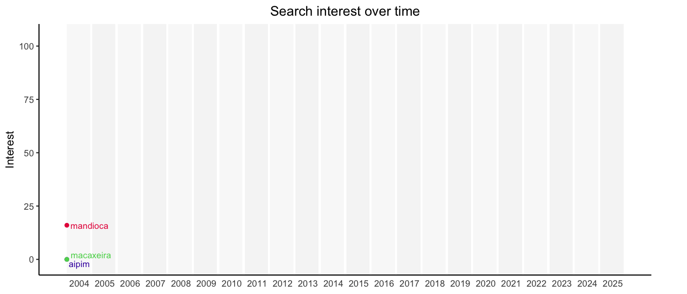

```{r setup, include=FALSE}
library(gtrendsR)
library(dplyr)
library(stringr)
library(lubridate)
library(ggplot2)
library(gifski)
library(gganimate)
library(rnaturalearth)
library(geobr)
library(sf)
library(ggrepel)
library(ggiraph)

sf_use_s2(use_s2 = FALSE)
```

Mandioca (aka cassava) is a staple food likely originating in the Brazilian Cerrado (i.e. Brazilian Savannah). In Brazil it goes by different names depending where you live: i.e. mandioca, macaxeira, and aipim. Here we take a look at regional variation in name usage, and seasonal variation in web searches for cassava in Brazil.

.jpg), CC-BY 2.0, Wikimedia Commons](preview-image.jpg){.lightbox width="70%"}

### FAQ:

1.  No, you cannot smoke it.

# Bit of context

::::: grid
::: g-col-7
Mandioca (*Manihot esculenta*, Euphorbiaceae) is a woody shrub with edible starchy [root tubers](https://en.wikipedia.org/wiki/Tuber). The tuber looks a bit similar to yams and sweet potatoes. Regular potatoes, as I just learned, are not actually roots but stem tubers. And both mandioca, and potatoes, and tomatoes, and corn(!) are originated in South America and domesticated by its native peoples. You are welcome.

In Brazil we eat mandioca in many different ways. It can often be deep fried (like french fries), boiled and eaten soft or as a purée/aligot. It is also often made into flour or starch and then used in a variety of cakes, breads, and other recipes. It is naturally gluten-free.

Brazil is a large country with plenty of linguistic variation in terms of accents and [regional dialects](https://www.babbel.com/en/magazine/brazilian-dialects). Across the country there are three main words used to refer to mandioca, all derived from the Old Tupi or Tupi-Guarani indigenous languages:

-   mandioca
-   macaxeira
-   aipim
:::

::: g-col-4
](thevet.png){.lightbox}
:::
:::::


I had a general sense of preferred word usage by region from having lived in Brazil most of my life. But I wanted to see if we can get some hard-ish evidence to see how widespread each word is in each of the 26 states and the Capital.

Enter Google Trends.

Google Trends collects and aggregates search data from its users and, until a minute ago* (see the ending), made that data available for free. We ~~can~~ could use the [gtrendsR](https://cran.r-project.org/package=gtrendsR) package to search for Google Trends data.

# The analysis

The `gtrends` function from the gtrendsR package can be called on a character vector of search terms, and retrieves a list with 7 items including three data-frames: interest_over_time, interest_by_region, and interest_by_city. Using [dplyr](https://dplyr.tidyverse.org/) magic we can reformat columns in the data frames to make them ready for the next steps.


```{r}
#| eval: true
#| code-fold: true
#| warning: false

# read in the data and tidy it up
tryCatch(
  {
    if (file.exists("trends_cached.rds")) {
      message("Reading cached search results.")
      trends <- readRDS("trends_cached.rds")
    } else {
      trends <- gtrends(
        c("aipim", "macaxeira", "mandioca"),
        geo = "BR",
        time = paste0("2004-01-01 ", today()),
        compared_breakdown = T
      )
      saveRDS(trends, "trends_cached.rds")
    }
  },
  error = function(e) {
    message("There were no cached search results and ")
    message("Google Trends search failed: ", e$message)
    NULL
  }
)

# rename columns and fix names
trends$interest_by_region <- trends$interest_by_region |>
  rename(
    state = location,
    hits = hits,
    keyword = keyword,
    geo = geo,
    gprop = gprop
  ) |>
  mutate(
    state = str_remove(state, "^State of "),
    state = if_else(state == "Federal District", "Distrito Federal", state),
    state = factor(state),
    hits = as.numeric(str_remove_all(hits, "%"))
  )
trends$interest_over_time <- trends$interest_over_time |>
  mutate(
    month = month(date, label = TRUE, abbr = FALSE),
    year = year(date)
  )

# define color palette for the keywords
mypalette <- c("#4421af", "#5ad45a", "#e60049")
```

I then get the worldmap from the `rnaturalearth` package excluding Brazil (`name != "Brazil"`), and then get the detailed Brazilian map with state data from the [`geobr`](https://github.com/ipeaGIT/geobr) package. After some state name formatting with [stringr](https://stringr.tidyverse.org/), I merged the map data frame with the gtrends interest_by_region data frame. Then more dplyr magic to get the term with most searches for each state (`group_by |> slice_max`). I also had to fix the country name position for Chile and French Guyana because I didn't like the default centroid position. Finally, I made some sort of bubble plot using ggplot2 and the `geom_point_interactive` from [ggiraph](https://cran.r-project.org/package=ggiraph).

I think the map (@fig-bubble) gives a pretty good visual overview of what's the preferred term used in each state (aggregated over 2004-2025). You can also spot some larger regional patterns, for e.g. macaxeira being the preferred term in almost every state of the northeastern region with the exception of Bahia (BA), which together with Espírito Santo (ES) and Rio de Janeiro (RJ) are the only states to search for aipim more. I wonder what's up with that.

```{r}
#| eval: true
#| code-fold: true
#| warning: false
#| label: fig-bubble
#| fig-cap: "Relative search term popularity by state (2004-2025). Mouse hover will show the two-letter state name abbreviation and the relative search popularity."

# code to plot relative term popularity by region for the whole period

# get world map without Brazil
worldmap <- ne_countries(scale = "medium", returnclass = "sf")
worldmap <- filter(worldmap, name != "Brazil")
# get country centroids to place name labels
worldmap_labels <- cbind(st_centroid(worldmap), 
                       st_coordinates(st_centroid(worldmap$geometry)))

# get Brazil maps
if (file.exists("brazil_country.rds")) {
  bra <- readRDS("brazil_country.rds")
} else {
  bra <- read_country()
  saveRDS(bra, "brazil_country.rds")
}

if (file.exists("brazil_states.rds")) {
  bra_states <- readRDS("brazil_states.rds")
} else {
  bra_states <- read_state()
  saveRDS(bra_states, "brazil_states.rds")
}

# fix state names
bra_states$name_state <- str_replace_all(bra_states$name_state, "De", "de")
bra_states$name_state <- str_replace_all(bra_states$name_state, "Do", "do")
bra_states$name_state <- str_replace_all(bra_states$name_state, "Espirito", "Espírito")

# merge interest_by_region data with Brazil map data
bra_states_merged <- merge(bra_states, trends$interest_by_region, by.x = "name_state", by.y = "state")
# get percentage of prevalent term for each state
bra_states_max <- bra_states_merged %>%
  group_by(name_state) %>%
  slice_max(order_by = hits, with_ties = F)
bra_states_max_label <- cbind(st_centroid(bra_states_max), 
                         st_coordinates(st_centroid(bra_states_max$geom)))
# Create label for state and popularity of preferred term
bra_states_max_label$label <- paste(bra_states_max_label$abbrev_state,": ",bra_states_max_label$hits, sep = "")

# labels for Chile and French Guyana
cfg <- data.frame(name=c("Chile","French Guyana"), X=c(-70,-50), Y=c(-25,5))

# Bubble map of relative search term popularity by state
theplot <- bra_states_max |>
  ggplot() + 
  geom_sf(data = worldmap, lwd = 0.1, color = "grey80", fill = "grey97") + 
  geom_sf(data = bra_states_max, lwd = 0.2, color = "grey60", fill = "antiquewhite") + 
  geom_point_interactive(data = bra_states_max_label, aes(x = X, y = Y, size = hits, color = keyword, tooltip = label)) +
  geom_text(data = worldmap_labels, 
            aes(x = X, y = ifelse(name=="Peru",Y-1,
                            ifelse(name=="Guyana",Y+2,Y)),
                label = ifelse(name=="Kiribati","",name)), 
            size = 3, color = "grey50") +
  geom_text(data = cfg, aes(x = X, y = Y, label = name), size = 3, color = "grey50") +
  coord_sf(xlim = c(-75, -30), ylim = c(-35, 7)) + 
  theme_classic() +
  scale_fill_manual(values = mypalette) +
  scale_color_manual(values = mypalette) +
  theme(axis.title = element_blank(), 
        axis.line = element_blank(),
        axis.ticks = element_blank(),
        axis.text = element_blank(),
        panel.border = element_rect(color = "black", fill = NA),
        panel.background = element_rect(fill = "lightblue1")) +
  guides(color = guide_legend(override.aes = list(size =  4)))
girafe(theplot)
```


Now let's look at how search frequency behaves over time during this 20 year period. I used [lubridate](https://lubridate.tidyverse.org/) to parse the dates and create alternating shaded rectangles corresponding to the years. Dealing with dates is always tricky and there's probably better ways of doing this but I found the `%m+%` operator very handy. 

We can again use dplyr's beautiful `group_by |> slice_max` syntax to extract the peak in search volume for each year. I did this for the term mandioca only because I didn't want to display too many labels. But you'll see in the plot that the three terms peak at roughly the same time (June-July) every year (@fig-line). 


```{r}
#| code-fold: true
#| eval: true
#| warning: false
#| label: fig-line
#| fig-cap: "Search term popularity over time (2004-2025)."

# create a seq of dates in June of each year to center the year labels
dbreaks <- parse_date_time(x = paste0(min(trends$interest_over_time$year),"-06-30"), orders = "ymd") %m+% 
  years(x = seq.int(from = 0, to = length(unique(trends$interest_over_time$year))-1, by = 1))

# create a dataframe to shade years with geom_rect
ystart <- parse_date_time(x = min(trends$interest_over_time$date[trends$interest_over_time$year==min(trends$interest_over_time$year)]), orders = "ymd") %m+%   years(x = seq.int(from = 0, to = length(unique(trends$interest_over_time$year))-1, by = 1))
yend <- parse_date_time(x = max(trends$interest_over_time$date[trends$interest_over_time$year==min(trends$interest_over_time$year)]), orders = "ymd") %m+% 
  years(x = seq.int(from = 0, to = length(unique(trends$interest_over_time$year))-1, by = 1))
yshades <- data.frame(ystart=ystart,yend=yend)

# get the peak labels
yearmax <- trends$interest_over_time |>
  filter(keyword == 'mandioca') |>
  group_by(year) |>
  slice_max(order_by = hits, with_ties = F)

# plot temporal search interest
p2 <- ggplot() + 
  geom_rect(data = yshades,
            aes(xmin=ystart,xmax=yend,ymin=-Inf,ymax=Inf), 
            color = NA, fill="grey", alpha = rep(c(0.1,0.15),length(unique(trends$interest_over_time$year))/2)) +
  geom_line(data = trends$interest_over_time, 
            aes(x = date, y = hits, color = keyword), lwd = 1) +
  geom_point(data = trends$interest_over_time, 
             aes(x = date, y = hits, color = keyword)) +
  geom_text(data = yearmax, 
            aes(x=date,y=hits,label=month,group=date),
            nudge_y = 5, size = 3, color="black") +
  geom_text(data = trends$interest_over_time, 
            aes(x = date, y = hits, label = keyword, color = keyword), 
            hjust = -0.1, size = 3,
            nudge_y = ifelse(trends$interest_over_time$keyword == "aipim", -2,
                             ifelse(trends$interest_over_time$keyword == "macaxeira", 2, 0))) +
  scale_x_datetime(date_labels = "%Y", breaks = dbreaks) +
  scale_color_manual(values = mypalette) +
  ylab("Interest") + 
  ggtitle("Search interest over time") +
  theme_classic() +
  theme(axis.ticks.x = element_blank(), 
        axis.title.x = element_blank(), 
        legend.title = element_blank(),
        legend.position = "none",
        plot.title = element_text(hjust = 0.5),
        plot.margin = unit(c(5.5, 35, 5.5, 5.5), "pt"),
        panel.grid = element_blank()) +
  coord_cartesian(clip = "off") +
  transition_reveal(along = date)

# creating the animated plot takes a long time so I'm doing it once interactively 
# and then just loading the gif with include_graphics.
if (interactive()) {
  p2_anim <- animate(
    plot = p2,
    height = 600,
    width = 1400,
    res = 150,
    fps = 25,
    duration = 10,
    end_pause = 80
  )
  anim_save(filename = "interest_over_time.gif", animation = p2_anim)
}

```

If you are from Brazil you probably have a guess of what's happening. And if you're not from Brazil let me offer a possible explanation. The searches peak around the ["Festa de São João"](https://en.wikipedia.org/wiki/Festa_Junina), often just called São João (Saint John's Day). This tradition was initially disseminated by the Portuguese Catholic church but blended and adapted quickly into local festivities. This party is also linked to pagan celebrations of the winter's solstice (summer's solstice in the Northern hemisphere). Carnival (usually in February or March) is the largest party in the world, but in some regions of Brazil, São João celebrations surpass it, attracting even more people.

Many of the foods linked to this celebration use mandioca as the main ingredient. Some examples are: [mané pelado](https://pt.wikipedia.org/wiki/Man%C3%A9_pelado), [pão de queijo](https://en.wikipedia.org/wiki/P%C3%A3o_de_queijo), [escondidinho](https://pt.wikipedia.org/wiki/Escondidinho), and others.

I think other factors like harvest time and market availability might impact the search patterns as well. And winter might be a good season to enjoy mandioca meals or cook more in general. But overall I'd guess São João is driving most of this trend. Would love to talk to mandioca market analysts to see if my guess is right.

# The analysis that wouldn't

I also wanted to see if the preferred term could change over time for a state, and to do that I would need to do one gtrends search per pear for my period. Unfortunately Google is closing up access before I had a chance to save the results of this search. They are releasing an [API](https://developers.google.com/search/blog/2025/07/trends-api) for Google Trends which will almost certainly not be free, and will make packages like gtrendsR or pytrends not work (`Error Status code was not 200. Returned status code:429`) for now. As of today you can still search on their [website](https://trends.google.com/trends/) and see some plots, but you don't get to dplyr it so what's the point 😞.

The code I was working on is pasted below in case someone wants to take a look. 

```{r}
#| code-fold: true
#| eval: false
mydatalist <- list()
for (i in 2004:2025) {
  mydatalist[[paste("d", i, sep = "")]] <- gtrends(
    c("aipim", "macaxeira", "mandioca"),
    geo = "BR",
    time = paste0(i, "-01-01 ", i, "-12-31"),
    compared_breakdown = T
  )
  mydatalist[[paste("d", i, sep = "")]]$interest_by_region <- mutate(
    mydatalist[[paste("d", i, sep = "")]]$interest_by_region,
    year = as.numeric(i)
  )
  Sys.sleep(3)
}

# create empty dataframe, then combine `interest_by_region` dataframes from all years
region_interest <- mydatalist$d2004$interest_by_region[FALSE, ]
for (i in names(mydatalist)) {
  region_interest <- rbind(region_interest, mydatalist[[i]]$interest_by_region)
}

# rename columns and fix names
region_interest <- region_interest |>
  rename(
    state = location,
    hits = hits,
    keyword = keyword,
    geo = geo,
    gprop = gprop
  ) |>
  mutate(
    state = str_remove(state, "^State of "),
    state = if_else(state == "Federal District", "Distrito Federal", state),
    state = factor(state),
    hits = as.numeric(str_remove_all(hits, "%"))
  )
region_interest <- region_interest |>
  mutate(
    month = month(date, label = TRUE, abbr = FALSE),
    year = year(date)
  )

# Let's borrow the centroid coordinates for each state from my previous dataframe
region_interest_max <- 
  merge(region_interest_max, bra_states_max_label %>% select(name_state,X,Y), 
        by.x = "state", by.y = "name_state")

p3 <- ggplot() + 
  geom_sf(data = bra_states_max, lwd = 0.2, color = "black", fill = "antiquewhite") + 
  geom_point(data = region_interest_max, 
             aes(x = X, y = Y, size = hits, color = keyword, group = year)) +
  geom_text(data = cfg, aes(x = X, y = Y, label = name), size = 3, color = "grey50") +
  ggtitle(label = "Year: {frame_time}") +
  coord_sf(xlim = c(-75, -30), ylim = c(-35, 7)) + 
  theme_classic() +
  scale_fill_manual(values = mypalette) +
  scale_color_manual(values = mypalette) +
  theme(axis.title = element_blank(), 
        legend.title = element_blank(),
        axis.line = element_blank(),
        axis.ticks = element_blank(),
        axis.text = element_blank(),
        panel.border = element_rect(color = "black", fill = NA),
        panel.background = element_rect(fill = "lightblue1"),
        plot.title = element_text(hjust = 0.9, face = "bold", margin = margin(t=30,b=-30))) +
  transition_time(year)

if (interactive()) {
  p3_anim <- animate(
    plot = p3,
    height = 900,
    width = 900,
    res = 150,
    nframes = 10,
    duration = 15
  )
}

anim_save(filename = "regional_interest_over_time.gif", animation = p3_anim)
```


That's it for this little experiment. And remember to always save a local copy when you retrieve remote data, because the web is a shifty place and one must not make unnecessary journeys.

